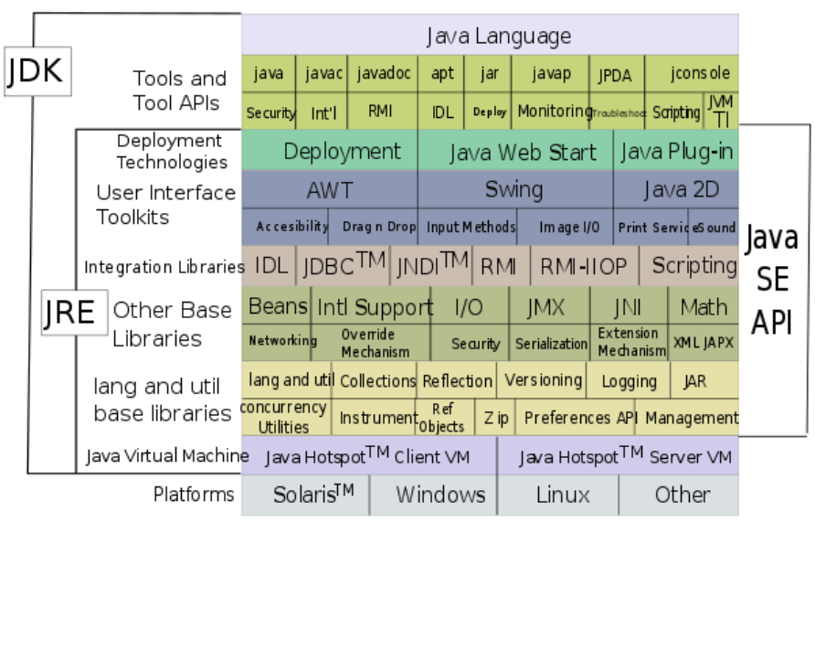

Java参数传递：基本类型肯定是传值；在函数外创建对象，在函数内引用。
特殊情况：函数内调用另一个函数B，函数B返回的对象是要传出的。使用容器的addAll方法。

Java静态模块
static{…}

?运算符 
total = (0 == num) ? 0 : (total / num);

for/in方式
container参数化，那么遍历变量可以是具体的类型， 如果定义container式没有参数化，那么使用时只能是Object。不能做什么：定位，删除项目。
List <String> wordlist = new ArrayList <String>();
for (String word : wordlist) {
  System.out.print(word + " ");}

字符串集合排序：SortedSet和TreeSet

Set<String> temp= getTermSet();
SortedSet<String> termSet = new TreeSet<String>();
for (String term : temp) {
termSet.add(term);
}
for (String term : termSet) {
}

jar命令。直接运行jar，得到命令帮助。默认将当前目录的文件及子目录打包。
jar -cf mytest.jar .    ----将当前目录内的文件及子目录打包为mytest.jar，在包内生成META-INFO子目录，在包内的META-INFO子目录下生成基本空置的manifest.mf文件
java -jar jar包 包路径.含有main的类名。如果manifest文件指定了主类，执行时可省。java -jar xxx.jar。

对象序列化
１：当一个对象被序列化时，只保存对象的非静态成员变量，不能保存任何的成员方法和静态的成员变量。
２：如果一个对象的成员变量是一个对象，那么这个对象的数据成员也会被保存。
３：如果一个可序列化的对象包含对某个不可序列化的对象的引用，那么整个序列化操作将会失败，
并且会抛出一个NotSerializableException。我们可以将这个引用标记为transient，那么对象仍然可以序列化。
还有我们对某个对象进行序列化时候，往往对整个对象全部序列化了，
比如说类里有些数据比较敏感，不希望序列化，一个方法可以用transient来标识，另一个方法我们可以在类里重写。

什么是Servlet?  
Servlet就是JAVA 类，继承HttpServlet类的类，在服务器端运行，用以处理客户端的请求。
运行servlet，需要一个servlet runner(或称servlet容器，有时叫servlet引擎，如tomcat等)。

Tomcat  
A web server，An application that executes Java servlets。
An application that converts JSP pages and documents into Java servlets

Java VM

Java Web
典型的Java Web应用程序架构有四个层：客户层（Client），展示层（Presentation），服务/业务层（Service/Business）和数据层（Data）。

Java部署

JDK和JRE

